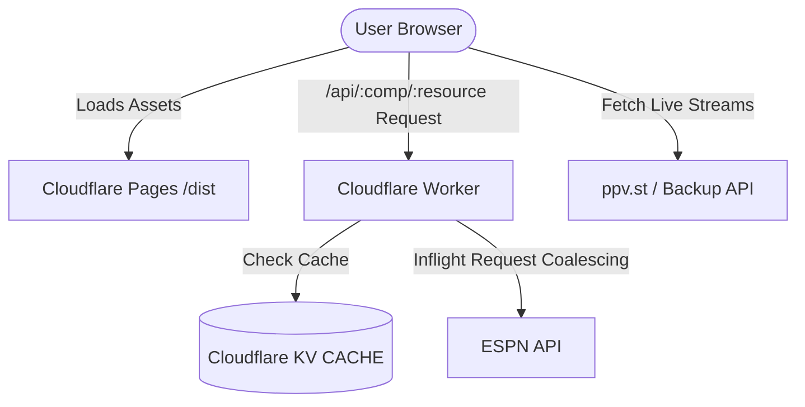

# Repository Guidelines

## Project Overview
StreamCup is a high-performance, lightweight web application for tracking sports event schedules, standings, statistics, and live streams (supporting FIFA World Cup, Premier League, NBA, etc.). It consists of a React-based Single Page Application (SPA) on the frontend and a Cloudflare Workers proxy on the backend to cache and coalesce ESPN API requests.

## Architecture & Data Flow

* **Frontend SPA**: React 18 application built with Vite and Tailwind CSS. It features a hand-rolled History API router (`src/utils/router.ts`), custom Contexts for state/theme/i18n, and custom hooks with page-visibility-aware background polling (every 30s for matches, 60s for streams).
* **SportAdapter System**: Located in `src/adapters/`. An abstract `SportAdapter` interface (`types.ts`) is implemented by `soccer` and `basketball` adapters to normalize raw ESPN API responses into standard frontend structures (`CompMatch[]`, `StandingsData`, `MatchDetail`).
* **Backend Edge Proxy**: Cloudflare Worker (`worker/index.ts`) serving `/api/:comp/*` requests. It validates parameters, caches raw data in Cloudflare KV using a Stale-While-Revalidate (SWR) strategy, and coalesces concurrent requests in memory to minimize upstream load.
* **Stream Coupling**: At runtime, client-side code cross-references the ESPN fixtures with third-party live stream APIs (matching via slugified canonical team names in `src/utils/streamMatch.ts`) and renders interactive player overlays for live matches.

## Key Directories
* `src/adapters/`: Sports normalization layer containing `soccer.ts`, `basketball.ts`, and interface `types.ts`.
* `src/components/`: Modular React components. Subfolders include `matchdetail/` for tabbed subviews.
* `src/hooks/`: Data hooks (`useCompetition.ts`, `useMatchDetail.ts`, `useStreams.ts`, `useLeaders.ts`, `useBracket.ts`) managing polling, SWR caching, and request aborting.
* `src/utils/`: Pure utilities (e.g., `router.ts` for routing, `calendar.ts` for `.ics`/Google Calendar, `streamSources.ts` for trusted hosts, `espn.ts` for soccer 2D tactical coordinate mapping, `helpers.ts` for Slugify).
* `src/i18n/` & `src/theme/`: Providers/Contexts for internationalization (`messages.ts`) and theme switcher (`index.tsx`).
* `worker/`: Cloudflare Worker entrypoint (`index.ts`) and its Vitest unit tests.
* `docs/`: Design specifications (`docs/superpowers/specs/`) and development implementation plans (`docs/superpowers/plans/`).

## Development Commands
All commands run via the **Bun** runtime:
* `bun run dev`: Start local Vite development server on port 5173 (with local API proxy rules).
* `bun run build`: Run frontend and worker typechecks followed by static assets build via Vite.
* `bun run test`: Run the Vitest test suite.
* `bun run typecheck`: Run TypeScript compilation check for both React app and Worker code.
* `bun run lint`: Run Biome linter.
* `bun run format`: Run Biome formatter auto-write.

## Code Conventions & Common Patterns

### 1. Formatting & Code Style
* **Toolchain**: **Biome** (v2.5.1) is used exclusively for linting and formatting. Do not use Prettier or ESLint. Styling and rules are defined in `biome.json`.
* **CSS Class Ordering**: Tailwind CSS utility classes are sorted according to Biome styling rules.
* **Apple Sports Glassmorphism Style**:
  * Standard Card (`.ds-glass`): `rounded-card border border-line/30 bg-panel/85 shadow-panel backdrop-blur-md`
  * Hero Panel (`.ds-glass-hero`): `rounded-panel md:rounded-hero border border-line/30 bg-gradient-to-b from-panel/95 to-panel/85 shadow-hero backdrop-blur-md`
  * Proportional corner radiuses: `--r-panel` (24px) base. `rounded-sm` / `rounded-card` / `rounded-panel` / `rounded-hero` are all 24px; micro-elements use `rounded-micro` (3px); capsules/buttons use `rounded-pill` (9999px).

### 2. Naming Conventions
* **Files**: PascalCase for components (e.g. `MatchCard.tsx`); camelCase for hooks, utilities, and adapters (e.g. `useCompetition.ts`, `router.ts`, `soccer.ts`).
* **Test files**: Co-located with code; naming template `<name>.test.ts` or `<name>.test.tsx`.
* **Slugification**: Clean team/match names via Unicode-safe kebab-case slugifier (`src/utils/helpers.ts`).

### 3. State Management & Routing
* **State Scope**: Keep React state local or context-based. No heavy state managers. Settings are synchronized across tabs using the `storage` event listener on `localStorage`.
* **Custom Routing**: Managed by `src/utils/router.ts`. The router triggers a custom `'app:routechange'` event when routing programmatically. Avoid external router libraries. Wrap path decoding parameters in `safeDecode` to prevent `URIError` crash from malicious URI payloads.

### 4. Async & Polling Patterns
* **Abort Controllers**: Every React effect hook that performs a fetch MUST register and listen to an `AbortSignal` via `AbortController` to cancel pending fetches on component unmount or state re-fetch.
* **Visibility-Gated Polling**: Custom hooks poll every 30s (matches/competition) or 60s (live streams/leaders). They listen to browser `visibilitychange` to suspend timers in the background and resume instantly when the tab is focused.

### 5. Backend Worker Conventions
* **KV SWR Cache**: Cache response bodies in KV via `CACHE.get`/`CACHE.put` with TTLs (60s for scoreboard, 300s for standings, 30s for summary, 1h for leaders).
* **Request Coalescing**: Map active promises in memory (`inflight` Map) to share concurrent upstream requests, preventing duplicate requests from hitting the ESPN API.
* **Serve Stale on Error**: Catch upstream errors and return stale data from KV if available instead of failing.

## Important Files
* `src/main.tsx`: SPA mount entrypoint & Service Worker registration.
* `src/App.tsx`: Top-level router coordinator and layout renderer.
* `src/competitions.ts`: Master configuration defining supported competitions (FIFA World Cup, Premier League, NBA), capacities, and ESPN endpoint URL generation.
* `worker/index.ts`: Edge Worker executing caching, request coalescing, and retries.
* `public/sw.js`: PWA service worker with Cache-First (hashed assets) and Network-First (index.html) policies.

## Runtime/Tooling Preferences
* **Runtime**: **Bun** (lockfile: `bun.lock`).
* **Linter/Formatter**: **Biome** (v2.5.1). Do not write eslint/prettier configs.
* **TypeScript Targets**:
  * Frontend: `tsconfig.json` (includes `DOM` types, target `ES2023`).
  * Backend Worker: `tsconfig.worker.json` (target `ES2024`, excludes `DOM` library to prevent invalid references in workerd context).

## Testing & QA
* **Framework**: **Vitest** (v1.6.1) is the test runner.
* **Environments**:
  * Frontend components (`src/**/*.test.tsx`, `src/**/*.test.ts`) run in a **JSDOM** environment.
  * Worker tests (`worker/**/*.test.ts`) run in a **Node** environment via `// @vitest-environment node` header comments.
* **Execution & Mocking**:
  * Tests run sequentially (`fileParallelism: false` in `vite.config.ts`) to prevent cross-contamination of global mocks (like global `fetch` overrides).
  * Always clean up mock states in `afterEach` via `vi.restoreAllMocks()`.
  * Use `Object.defineProperty(window, 'location', ...)` to mock location paths for route testing.
