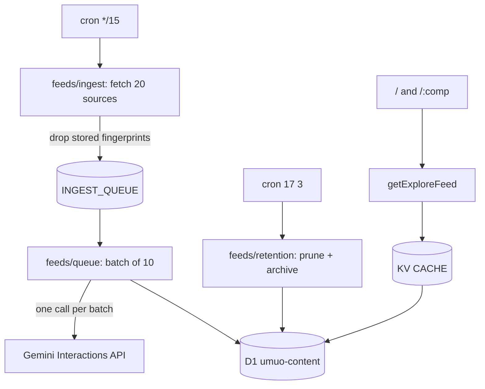

# Repository Guidelines

## Project Overview

**umuo** (`https://umuo.app`) is an AI-curated football news desk. A Cloudflare cron pulls ~20 RSS and JSON feeds every 15 minutes, a Gemini agent classifies and summarises each new article into D1, and an Astro SSR app renders that corpus as a full-bleed masonry board with a source / competition / topic index.

The original ESPN scoreboard half (schedule/standings/stats/odds/match/team/player pages) was removed in 2026 — the product is now pure news ingestion + AI processing, and nothing else reads ESPN's public APIs. ESPN survives only as one of the ~20 feed sources.

## Data plane

`ingestAllSources` fans out over `FEED_SOURCES` (RSS/JSON incl. per-league ESPN news), normalises to `RawArticle`, drops anything whose fingerprint is already stored, and enqueues the rest. The consumer re-checks for duplicates, sends whatever survives as **one** Gemini interaction, then writes each article and its tags. Reads go through `getExploreFeed` / `getExploreFilters`, cached in KV.

## Architecture notes

- **SSR, no client router.** Every view is an independent document. Navigation is `<a href>`; there is no history API in play. Anything an island renders must be identical on the server and at hydration.
- **KV SWR core** (`runCached`): fresh window → `HIT`, in-flight coalescing via a module-level `Map`, upstream failure serves stored stale data as `STALE` or 502. Emits `x-cache`. D1 queries (explore feed, filters, sitemap news) go through it; free-text search bypasses KV.
- **Chrome ownership.** `Layout.astro` is the shell (head/meta/theme/PWA + `Footer`). The explore pages carry the wordmark and theme switcher in `ExploreView`'s own toolbar.
- **Registries are the source of truth.** `src/competitions.ts` (football leagues + the ESPN league-news URL builder used by the ingest sources), `src/feeds/sources.ts` (feeds), `src/site.ts` (canonical origin for canonical/og/sitemap). Adding a league is registry-only.

## Key directories

- `src/pages/` — `/` (news home), `/[comp]` (per-competition news hub), `api/[...route].ts` (dispatches to `worker/index.ts`), `sitemap.xml.ts`.
- `src/feeds/` — the news pipeline. `sources.ts` (registry, incl. per-league ESPN news sources), `ingest.ts` (cron side), `rss.ts`, `queue.ts` (consumer), `gemini.ts` (model I/O), `enrich.ts` (dedupe + write), `retention.ts` (sweep + `PRUNE_CRON`). `newsFeed.ts` parses the ESPN league-news JSON into `NewsItem`.
- `src/data/api.ts` — KV SWR core (`runCached`/`json`) + the D1 explore queries and SSR composers.
- `src/components/explore/` — `ExploreView` (rail, toolbar, masonry, infinite scroll), `ExploreCard`. `Logo`/`ThemeSwitcher`/`Footer` are shared chrome.
- `migrations/` — D1 schema. Applied by `bun run deploy`, never automatically.
- `worker/entrypoint.ts` — `fetch` (Astro), `scheduled` (cron), `queue` (consumer). `worker/index.ts` is the `/api/*` dispatcher (explore endpoints + ASSETS passthrough).

## Commands

Bun locally, `workerd` in production.

- `bun run dev` — Astro dev server with local Miniflare KV + D1.
- `bun run build` — `astro check && tsc -p tsconfig.worker.json && astro build`.
- `bun run typecheck` / `lint` / `format` — app + worker types, Biome.
- `bunx vitest run` — full suite. `bunx vitest run <file>`, `-t "<name>"` to narrow.
- `bun run deploy` — **migrations then deploy**. Workers Builds must be configured to run this, not bare `wrangler deploy`, or migrations silently never apply.
- `bunx wrangler d1 execute umuo-content --remote --command "…"` — inspect production data.

## Infrastructure

| | |
|---|---|
| Worker | `umuo`, deployed by Workers Builds from `main` |
| KV | `CACHE` `b5d6927e…` |
| D1 | `DB` → `umuo-content`, primary region **APAC** (cannot be moved without recreating) |
| Queue | `INGEST_QUEUE` → `umuo-news-ingest`, batch 10, `max_retries = 5` (failed messages dropped after 5 retries; per-article fallback in `queue.ts` + 15-minute re-ingest cover what a DLQ would have caught) |
| Crons | `*/15 * * * *` ingest, `17 3 * * *` retention sweep |
| Secret | `LLM_API_KEY`, `LLM_MODEL` (`wrangler secret put`) |

## Conventions

- **Biome 2.5.1**: 2-space, single quotes, semicolons, trailing commas, 100 cols, arrow parens always. Excludes `*.css`, `dist`, `.astro`, `worker-configuration.d.ts` (generated by `wrangler types`; regenerate rather than hand-edit).
- **Naming**: PascalCase components and layouts, `*Island.tsx` for hydration wrappers, camelCase hooks and utilities, tests colocated as `<name>.test.ts(x)`.
- **Defensive ESPN parsing**: the untyped ESPN league-news JSON goes through `src/utils/coerce.ts` (`obj`, `arr`, `str`). ESPN omits fields without warning.
- **Cancellation**: `ExploreView`'s fetch binds an `AbortController`; the effect aborts on unmount and key change.
- **Degrade, don't crash**: SSR composers return empty arrays on failure. The explore island swallows `AbortError` and keeps the last good state.
- **Copy is English**; Chinese comments explaining non-obvious logic are kept when editing around them.
- **Commits** carry `Co-Authored-By: Claude <noreply@anthropic.com>`.

## Testing

Vitest 4, `jsdom`, `globals: true`, `fileParallelism: false` (tests mutate global fetch and location). `worker/index.test.ts` overrides with `// @vitest-environment node`.

Patterns: `@testing-library/react` for components, `renderHook` with a mocked `globalThis.fetch` for hooks, direct `GET` / `onRequest` invocation for Astro routes and middleware, Map-backed KV and a `fetchMock` for edge semantics.

**A passing suite is not evidence code runs.** Modules have kept green suites long after nothing imported them. When you delete a module, delete its tests, then walk imports from every route, `middleware.ts` and `worker/entrypoint.ts` to see what else is orphaned.

## Gotchas

Each of these cost real debugging. They are not hypothetical.

- **ESPN allow-lists user agents by name.** `curl/*`, `python-requests/*` and `Go-http-client/*` are served; a browser UA, *no* UA at all, `Wget`, `node` and an honest `umuo-football-news/1.0` all get 403. The only call site left is the ingest pipeline's ESPN league-news fetch — `API_JSON_HEADERS` in `src/feeds/ingest.ts` sends `curl/8.7.1`. If the ESPN sources go dry, check this first.
- **Explore cursors are keyset, not offsets** — `<published_at>:<id>`. The feed has rows inserted at the top every tick, so an offset slides the window under the reader. Type guards on `ExploreFeed.nextCursor` must say `string`; when one said `number`, every SSR page silently reported the feed exhausted.
- **`PRUNE_CRON` is duplicated in `wrangler.jsonc`** because a Worker cannot read that file. `retention.cron.test.ts` holds them together. Anything that is not `PRUNE_CRON` is treated as an ingest tick, so a stray third schedule means an extra full fan-out.
- **Never DELETE from `articles`.** Retention archives instead: dropping a row takes its `canonical_url` and `fingerprint` with it, and the next tick re-ingests and re-enriches the same story. Deletion costs Gemini calls.
- **Dedupe before the model, not after.** `ingestAllSources` filters stored fingerprints before enqueueing and the consumer re-checks before calling Gemini. Both matter: without them a tick re-enqueues every article in every feed.
- **Explore cache keys embed the query.** Free-text `q` bypasses KV entirely — it is user-controlled and unbounded, and caching it let anyone write KV keys without limit. Cursors are re-serialised from their parsed form for the same reason.
- **Durable Objects break PR builds.** Workers Builds runs `wrangler versions upload` for preview branches, which cannot apply a DO migration. The queue consumer calls its functions directly for this reason.
- **`wrangler dev --remote` does not support Queues** and returns 1042 on the scheduled endpoint. To trigger an ingest by hand, set a one-shot cron, deploy, let it fire, then remove it.
