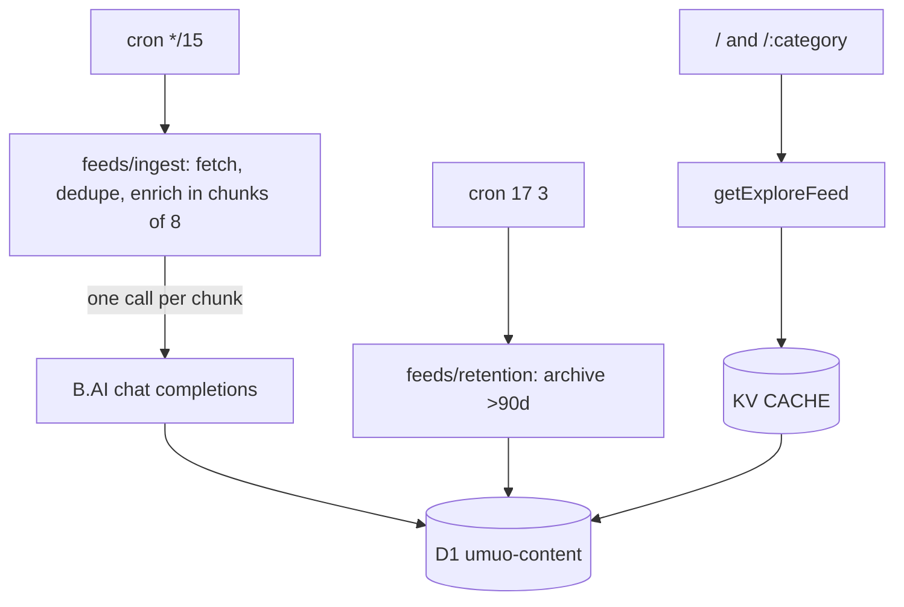

# Repository Guidelines

## Project Overview

**umuo** is an AI-curated PC hardware & peripherals news desk. A Cloudflare cron pulls 15 RSS/Atom feed sources every 15 minutes, a B.AI chat-completions agent (OpenAI-compatible, model `deepseek-v4-flash`) classifies and summarises each new article into D1, and an Astro SSR app renders that corpus as a full-bleed masonry board with a source / category / topic index.

2026 pivot: the original football desk was replaced with a keyboard/mouse/peripherals/PC-hardware desk. The ESPN scoreboard and league-news JSON half is gone entirely; ingestion is RSS/Atom-only.

## Architecture & Data Flow

`ingestAllSources` fans out over `FEED_SOURCES` (15 verified RSS/Atom sources: 9 broad hardware desks + 5 category-verticals with publisher-declared `category` + 1 Reddit community feed, 2 of the verticals being keyboard/mouse subreddits), normalises to `RawArticle`, drops anything whose fingerprint or normalized title is already stored, and enriches the survivors directly in sequential chunks of eight. Each completed chunk is written to D1 before the next chunk starts, so a long backlog keeps its progress if the scheduled invocation ends early. Reads go through `getExploreFeed` / `getExploreFilters`, cached in KV.

## Key Directories

- `src/pages/` — `/` (news home), `/[category]` (per-category hub), `/a/[id]` (article detail), `api/[...route].ts` (delegates to `worker/index.ts`), `rss.xml.ts` + `[category]/rss.xml.ts` (RSS 2.0), `sitemap.xml.ts`, `sitemap-news.xml.ts`.
- `src/feeds/` — the news pipeline. `sources.ts` (registry, with publisher-declared category presets), `ingest.ts` (cron-side fetch, dedupe, chunked enrichment), `rss.ts` (regex RSS/Atom parse), `llm.ts` (model I/O + validation), `enrich.ts` (dedupe + write), `retention.ts` (sweep + `PRUNE_CRON`), `readable.ts` (HTML→text body extraction), `types.ts`.
- `src/categories.ts` — the 10-category registry (peripherals: keyboards/mice/audio/gear; hardware: gpu/cpu/memory/storage/monitor/cooling).
- `src/data/api.ts` — KV SWR core (`runCached`/`json`) facade + the D1 explore queries and SSR composers (implementation split across `cache.ts`, `explore.ts`, `article.ts`, `sitemapData.ts`).
- `src/components/explore/` — `ExploreView` (rail, toolbar, masonry, infinite scroll), `ExploreCard`. `Logo`/`Footer` are shared chrome.
- `migrations/` — D1 schema (0001–0009). Applied by `bun run deploy`, never automatically.
- `worker/entrypoint.ts` — `fetch` (Astro), `scheduled` (cron). `worker/index.ts` is the `/api/*` dispatcher (explore endpoints + ASSETS passthrough).
- `design-tokens/` — W3C design-tokens JSON; `src/index.css` and `tailwind.config.js` map to it.

## Development Commands

Bun locally, `workerd` in production.

- `bun run dev` — Astro dev server with local Miniflare KV + D1.
- `bun run build` — `astro check && tsc -p tsconfig.worker.json && astro build` (typecheck gates the build).
- `bun run typecheck` / `lint` / `format` — app + worker types, Biome.
- `bunx vitest run` — full suite. `bunx vitest run <file>`, `-t "<name>"` to narrow. `bun run test` = watch mode.
- `bun run deploy` — **migrations then deploy**. Workers Builds must be configured to run this, not bare `wrangler deploy`, or migrations silently never apply.
- `bunx wrangler d1 execute umuo-content --remote --command "…"` — inspect production data.

## Code Conventions & Common Patterns

- **Biome 2.5.1**: 2-space, single quotes, semicolons, trailing commas, 100 cols, arrow parens always. Excludes `*.css`, `dist`, `.astro`, `worker-configuration.d.ts` (generated by `wrangler types`; regenerate rather than hand-edit).
- **Naming**: PascalCase components and layouts, `*Island.tsx` for hydration wrappers, camelCase hooks and utilities, tests colocated as `<name>.test.ts(x)`.
- **SSR, no client router.** Every view is an independent document. Navigation is `<a href>`; there is no history API. Anything an island renders must be identical on the server and at hydration — dates are formatted UTC-only.
- **KV SWR core** (`runCached`): fresh window → `HIT`, in-flight coalescing via a module-level `Map`, upstream failure serves stored stale data as `STALE` or 502. Emits `x-cache`. D1 queries (explore feed, filters, sitemaps) go through it; free-text search bypasses KV.
- **Degrade, don't crash**: SSR composers return empty arrays on failure; the explore island swallows `AbortError` and keeps the last good state. Pages never query D1 directly — they go through `src/data/api.ts` getters.
- **Registries are the source of truth.** `src/categories.ts` (10 hardware categories), `src/feeds/sources.ts` (feeds, with optional publisher-declared `category`), `src/site.ts` (canonical origin for canonical/og/sitemap). Adding a category is registry-only. `sources.ts` throws at import time if a source declares an unknown category.
- **Cancellation**: `ExploreView`'s fetch binds an `AbortController`; the effect aborts on unmount and key change.
- **Copy is English**; Chinese comments explaining non-obvious logic are kept when editing around them.
- **Commits** carry `Co-Authored-By: Claude <noreply@anthropic.com>`.

## Important Files

- `src/categories.ts` — `CATEGORIES: Record<string, Category>` (10 keys: keyboards, mice, audio, gear, gpu, cpu, memory, storage, monitor, cooling). **The single validation gate** for category values — routes, facet filtering, KV-key safety, and enrichment fallback all check against it.
- `src/site.ts` — `SITE_ORIGIN`, `articlePath(id)` → `/a/{id}`, `articleDeck(article, 'short'|'long')`. The image-proxy helper was removed with the football desk; cards render feed images directly and hide broken ones.
- `src/data/api.ts` — `runCached`, `serveExplore`, `serveExploreRss`, `getExploreFeed`/`getExploreFilters`/`getArticle`/`getRelatedArticles`, sitemap composers. `EXPLORE_ARTICLE_COLUMNS` is the single shared projection.
- `src/feeds/ingest.ts` — `ingestAllSources(env, ctx)`, `canonicalizeUrl`, `fingerprintFor`, `fetchWithRetry`, `RSS_HEADERS`.
- `src/feeds/llm.ts` — `enrichWithLLM`/`enrichBatchWithLLM`, `CLASSIFIER_RULES` editorial prompt, `CONTROLLED_TAGS` (24 hardware tags).
- `src/feeds/enrich.ts` — `enrichBatch`, `storeEnrichedArticle`, `canonicalCategory`, `normalizeTag`, `MIN_QUALITY_SCORE`.
- `src/feeds/retention.ts` — `PRUNE_CRON = '17 3 * * *'`, `ARTICLE_ARCHIVE_DAYS = 90`.
- `worker/entrypoint.ts` / `worker/index.ts` — see Key Directories.
- `wrangler.toml` — all Cloudflare bindings/crons/vars (see Infrastructure).
- `env.d.ts` / `worker/env.d.ts` — hand-declared `Cloudflare.Env` for the two tsconfigs; must match `wrangler.toml` vars exactly.

## Runtime/Tooling Preferences

- **Bun is the only supported package manager** (`bun.lock` committed, npm/yarn/pnpm locks gitignored). Run tests via `bunx vitest`, never `bun test` (Bun's built-in runner ignores `vitest.config.ts`).
- **Config file is `wrangler.toml`** — not `wrangler.jsonc`. Some older doc-comments may still say `wrangler.jsonc`; don't propagate that.
- `worker-configuration.d.ts` is generated by `wrangler types` — regenerate after changing bindings/vars, never hand-edit. Biome excludes it.
- **No Durable Objects, deliberately.** Workers Builds runs `wrangler versions upload` for PR previews, which cannot apply a DO migration — adding one breaks every PR build.
- **No CI in the repo.** Deployment is Cloudflare Workers Builds from `main`, which must run `bun run deploy` (migrations-then-deploy) or migrations never apply.

## Infrastructure

|||
|---|---|
|Worker|`umuo`, deployed by Workers Builds from `main`|
|KV|`CACHE` `b5d6927ae…`|
|D1|`DB` → `umuo-content`, primary region **APAC** (cannot be moved without recreating)|
|Crons|`*/15 * * * *` ingest, `17 3 * * *` retention sweep|
|Vars|`LLM_BASE_URL = https://api.b.ai/v1`, `LLM_MODEL = deepseek-v4-flash` (plaintext `[vars]`)|
|Secret|`LLM_API_KEY` (`wrangler secret put`) — the only real secret|

## Testing & QA

Vitest 4, `jsdom`, `globals: true`, `fileParallelism: false` (tests mutate global fetch and location). `src/test-setup.ts` imports jest-dom and `afterEach(vi.restoreAllMocks())`. Files needing node/workerd semantics carry `// @vitest-environment node` on line 1 (13 files, incl. `worker/index.test.ts`).

Patterns:
- `react-dom/server` `renderToString` asserts SSR/hydration safety for the explore island (`ssr.test.tsx`).
- Fetch mocking via `vi.stubGlobal('fetch', fetchMock)` (must `vi.unstubAllGlobals()` yourself) or module-scope `globalThis.fetch = …` (`worker/index.test.ts`).
- Routes/worker tested by calling `worker.fetch(new Request('https://x/api/explore'), env, mockCtx())` directly — there is no Astro middleware/`onRequest`.
- KV/D1 mocked as `vi.fn()` spy objects cast `as unknown as Env` / `as unknown as Env['DB']`; SQL-capture mocks assert on `capturedSql`/`capturedBindings`.
- Module mocking via `vi.hoisted` + `vi.mock` before importing the module under test (see `ingest.batch.test.ts`).
- **Binding tests** pin duplicated constants to their on-disk copy: `retention.cron.test.ts` (wrangler.toml `crons` ↔ `PRUNE_CRON`), `index.css.test.ts` (design-tokens ↔ `index.css`). File-reading tests use `resolve(process.cwd(), …)` — jsdom mangles `import.meta.url`.

**A passing suite is not evidence code runs.** Modules have kept green suites long after nothing imported them. When you delete a module, delete its tests, then walk imports from every route, `middleware.ts` and `worker/entrypoint.ts` to see what else is orphaned. (Done for the football removal: `newsFeed.ts`, its JSON contract, the `obj/arr/str/slugify` ESPN coercers and the BBC image rewriter all went together.)

## Gotchas

Each of these cost real debugging. They are not hypothetical.

- **Some hardware publishers WAF non-browser agents.** Guru3D's `/rss/` path, VideoCardz and Overclock3D serve Cloudflare challenges to `curl`-style UAs — the verified URLs live in `sources.ts` (e.g. Guru3D works at `/rss.xml`, not `/rss/`). If a source goes dry, re-probe its URL with the exact `RSS_HEADERS` UA before assuming the pipeline is broken; Reddit returns transient 429s that `fetchWithRetry` absorbs.
- **Publisher-declared categories are presets, not law.** `source.category` pre-fills attribution, but `canonicalCategory` lets the LLM override it; the model may also return `''` for cross-category stories (laptops, full builds, industry news). Never assume a source's articles all share its preset.
- **`is_on_topic` gates everything.** Off-topic stories (phones, consoles, games, pure-software/AI news) are stored as `filtered` regardless of quality score. When adding sources that mix verticals (The Verge, Ars), trust the model gate — do not pre-filter by keyword in code.
- **Explore cursors are keyset, not offsets** — `<day_bucket>:<quality_score>:<published_at>:<id>`, where the day bucket is `floor(published_at/86400000)` and immutable, so the keyset is stable under inserts. Type guards on `ExploreFeed.nextCursor` must say `string`; when one said `number`, every SSR page silently reported the feed exhausted.
- **`PRUNE_CRON` is duplicated in `wrangler.toml`** because a Worker cannot read that file. `retention.cron.test.ts` holds them together. Anything that is not `PRUNE_CRON` is treated as an ingest tick, so a stray third schedule means an extra full fan-out.
- **Never DELETE from `articles`.** Retention archives instead: dropping a row takes its `canonical_url` and `fingerprint` with it, and the next tick re-ingests and re-enriches the same story. Deletion costs LLM calls. (Migration 0009 soft-offlined the whole football corpus with one `status = 'archived'` UPDATE for exactly this reason.)
- **Dedupe before the model, not after.** `ingestAllSources` filters stored fingerprints AND normalized titles before enrichment. Both matter: without them a tick would repeatedly pay to classify every article in every feed.
- **`sources.enabled` is an operator override, not a registry mirror.** `ensureSources` upserts kind/name/url/category/authority but deliberately never rewrites `enabled`; `enabledSources` intersects D1-enabled ids with `FEED_SOURCES`, so rows for sources that left the registry are inert. Do not bulk-flip `enabled` in a migration (0009 documents this).
- **Explore cache keys embed the query.** Free-text `q` bypasses KV entirely — it is user-controlled and unbounded, and caching it let anyone write KV keys without limit. Cursors are re-serialised from their parsed form for the same reason.
- **`description` is fingerprint-stable; `body` is model-facing.** `description` (teaser, ≤4000) feeds the fingerprint; `body` prefers feed `content:encoded` or a `fillBody` page fetch (≥400 chars, sliced to 3000). Changing description handling would re-ingest everything.
- **`freshness_score` column is dead.** Display freshness is computed at query time in SQL (`LIVE_FRESHNESS`, 72h decay window from `published_at`); the stored column defaults 0 and is ignored.
- **`wrangler dev --remote` does not support Queues** and returns 1042 on the scheduled endpoint. To trigger an ingest by hand, set a one-shot cron, deploy, let it fire, then remove it.