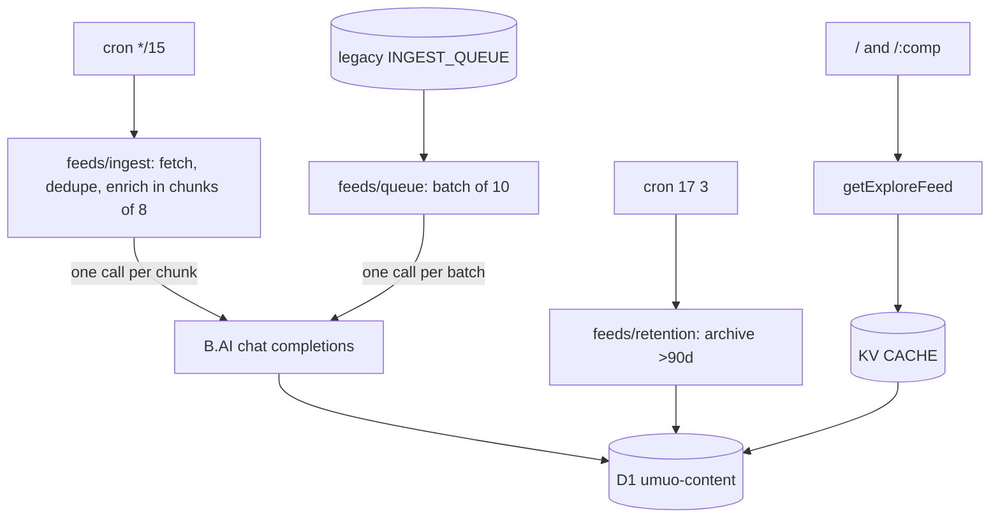

# Repository Guidelines

## Project Overview

**umuo** (`https://umuo.app`) is an AI-curated football news desk. A Cloudflare cron pulls 31 RSS/JSON feed sources every 15 minutes, a B.AI chat-completions agent (OpenAI-compatible, model `gpt-5.6-luna`) classifies and summarises each new article into D1, and an Astro SSR app renders that corpus as a full-bleed masonry board with a source / competition / topic index.

The original ESPN scoreboard half (schedule/standings/stats/odds/match/team/player pages) was removed in 2026 — the product is now pure news ingestion + AI processing, and nothing else reads ESPN's public APIs. ESPN survives only as one of the feed sources.

## Architecture & Data Flow

`ingestAllSources` fans out over `FEED_SOURCES` (31 sources: 5 global RSS + 12 per-competition RSS + 14 ESPN league-news JSON), normalises to `RawArticle`, drops anything whose fingerprint is already stored, and enriches the survivors directly in sequential chunks of eight. Each completed chunk is written to D1 before the next chunk starts, so a long backlog keeps its progress if the scheduled invocation ends early. The queue consumer remains for legacy messages, re-checks duplicates, sends whatever survives as **one** LLM interaction, then writes each article and its tags. New ticks do not enqueue messages — direct enrichment avoids the free-tier per-message quota. Reads go through `getExploreFeed` / `getExploreFilters`, cached in KV.

## Key Directories

- `src/pages/` — `/` (news home), `/[comp]` (per-competition hub), `/a/[id]` (article detail), `api/[...route].ts` (delegates to `worker/index.ts`), `rss.xml.ts` + `[comp]/rss.xml.ts` (RSS 2.0), `sitemap.xml.ts`, `sitemap-news.xml.ts`.
- `src/feeds/` — the news pipeline. `sources.ts` (registry, incl. per-league ESPN news sources), `ingest.ts` (cron-side fetch, dedupe, chunked enrichment), `rss.ts` (regex RSS/Atom parse), `queue.ts` (legacy consumer), `llm.ts` (model I/O + Zod validation), `enrich.ts` (dedupe + write), `retention.ts` (sweep + `PRUNE_CRON`), `readable.ts` (HTML→text body extraction), `indexnow.ts` (IndexNow pings), `types.ts`. `newsFeed.ts` parses the ESPN league-news JSON into `NewsItem`.
- `src/data/api.ts` — KV SWR core (`runCached`/`json`) + the D1 explore queries and SSR composers.
- `src/components/explore/` — `ExploreView` (rail, toolbar, masonry, infinite scroll), `ExploreCard`. `Logo`/`ThemeSwitcher`/`Footer` are shared chrome.
- `migrations/` — D1 schema (0001–0007). Applied by `bun run deploy`, never automatically.
- `worker/entrypoint.ts` — `fetch` (Astro), `scheduled` (cron), `queue` (consumer). `worker/index.ts` is the `/api/*` dispatcher (explore endpoints, image proxy, re-enrich + ASSETS passthrough).
- `design-tokens/` — W3C design-tokens JSON; `src/index.css` and `tailwind.config.js` map to it.

## Development Commands

Bun locally, `workerd` in production.

- `bun run dev` — Astro dev server with local Miniflare KV + D1.
- `bun run build` — `astro check && tsc -p tsconfig.worker.json && astro build` (typecheck gates the build).
- `bun run typecheck` / `lint` / `format` — app + worker types, Biome.
- `bunx vitest run` — full suite. `bunx vitest run <file>`, `-t "<name>"` to narrow. `bun run test` = watch mode.
- `bun run deploy` — **migrations then deploy**. Workers Builds must be configured to run this, not bare `wrangler deploy`, or migrations silently never apply.
- `bunx wrangler d1 execute umuo-content --remote --command "…"` — inspect production data.

## Code Conventions & Common Patterns

- **Biome 2.5.1**: 2-space, single quotes, semicolons, trailing commas, 100 cols, arrow parens always. Excludes `*.css`, `dist`, `.astro`, `worker-configuration.d.ts` (generated by `wrangler types`; regenerate rather than hand-edit).
- **Naming**: PascalCase components and layouts, `*Island.tsx` for hydration wrappers, camelCase hooks and utilities, tests colocated as `<name>.test.ts(x)`.
- **SSR, no client router.** Every view is an independent document. Navigation is `<a href>`; there is no history API. Anything an island renders must be identical on the server and at hydration — dates are formatted UTC-only, and `ThemeSwitcher` state starts `null` so SSR and first client render agree.
- **KV SWR core** (`runCached`): fresh window → `HIT`, in-flight coalescing via a module-level `Map`, upstream failure serves stored stale data as `STALE` or 502. Emits `x-cache`. D1 queries (explore feed, filters, sitemaps) go through it; free-text search bypasses KV.
- **Degrade, don't crash**: SSR composers return empty arrays on failure; the explore island swallows `AbortError` and keeps the last good state. Pages never query D1 directly — they go through `src/data/api.ts` getters.
- **Registries are the source of truth.** `src/competitions.ts` (14 football leagues + the ESPN league-news URL builder), `src/feeds/sources.ts` (feeds), `src/site.ts` (canonical origin for canonical/og/sitemap/IndexNow). Adding a league is registry-only.
- **Defensive ESPN parsing**: the untyped ESPN league-news JSON goes through `src/utils/coerce.ts` (`obj`, `arr`, `str`). ESPN omits fields without warning.
- **Cancellation**: `ExploreView`'s fetch binds an `AbortController`; the effect aborts on unmount and key change.
- **Copy is English**; Chinese comments explaining non-obvious logic are kept when editing around them.
- **Commits** carry `Co-Authored-By: Claude <noreply@anthropic.com>`.

## Important Files

- `src/competitions.ts` — `FOOTBALL_COMPETITIONS: Record<string, Competition>` (14 keys: eng.1, esp.1, ger.1, ita.1, fra.1, uefa.champions, uefa.europa, fifa.world, fifa.cwc, uefa.euro, conmebol.america, eng.fa, usa.1, ksa.1). **The single validation gate** for comp values — routes, facet filtering, KV-key safety, and enrichment fallback all check against it.
- `src/site.ts` — `SITE_ORIGIN = 'https://umuo.app'`, `articlePath(id)` → `/a/{id}`, `imgProxyUrl(src, width)`, `articleDeck(article, 'short'|'long')`.
- `src/data/api.ts` — `runCached`, `serveExplore`, `serveExploreRss`, `getExploreFeed`/`getExploreFilters`/`getArticle`/`getRelatedArticles`, sitemap composers. `EXPLORE_ARTICLE_COLUMNS` is the single shared projection.
- `src/feeds/ingest.ts` — `ingestAllSources(env, ctx)`, `canonicalizeUrl`, `fingerprintFor`, `fetchWithRetry`, `API_JSON_HEADERS` (ESPN UA spoof).
- `src/feeds/llm.ts` — `enrichWithLLM`/`enrichBatchWithLLM`, Zod `enrichmentSchema`/`batchSchema`, `CLASSIFIER_RULES` editorial prompt.
- `src/feeds/enrich.ts` — `enrichBatch`, `storeEnrichedArticle`, `reEnrichBatch`, `canonicalCompetition`, `normalizeTag`.
- `src/feeds/retention.ts` — `PRUNE_CRON = '17 3 * * *'`, `ARTICLE_ARCHIVE_DAYS = 90`.
- `worker/entrypoint.ts` / `worker/index.ts` — see Key Directories.
- `wrangler.toml` — all Cloudflare bindings/crons/vars (see Infrastructure).
- `env.d.ts` / `worker/env.d.ts` — hand-declared `Cloudflare.Env` for the two tsconfigs; must match `wrangler.toml` vars exactly.

## Runtime/Tooling Preferences

- **Bun is the only supported package manager** (`packageManager: bun@1.3.14`; `bun.lock` committed, npm/yarn/pnpm locks gitignored). Run tests via `bunx vitest`, never `bun test` (Bun's built-in runner ignores `vitest.config.ts`).
- **Config file is `wrangler.toml`** — not `wrangler.jsonc`. Several stale doc-comments (`src/feeds/retention.ts`, `env.d.ts`, `worker/env.d.ts`, `README.md`) still say `wrangler.jsonc`; don't propagate that.
- `worker-configuration.d.ts` is generated by `wrangler types` — regenerate after changing bindings/vars, never hand-edit. Biome excludes it.
- **No Durable Objects, deliberately.** Workers Builds runs `wrangler versions upload` for PR previews, which cannot apply a DO migration — adding one breaks every PR build. The queue consumer calls its functions directly for this reason.
- **No CI in the repo.** Deployment is Cloudflare Workers Builds from `main`, which must run `bun run deploy` (migrations-then-deploy) or migrations never apply.

## Infrastructure

|||
|---|---|
|Worker|`umuo`, deployed by Workers Builds from `main`|
|KV|`CACHE` `b5d6927ae…`|
|D1|`DB` → `umuo-content`, primary region **APAC** (cannot be moved without recreating)|
|Queue|`INGEST_QUEUE` → `umuo-news-ingest`, batch 10, `max_retries = 5`, no DLQ (failed messages dropped after 5 retries; per-article fallback in `queue.ts` + 15-minute re-ingest cover it)|
|Crons|`*/15 * * * *` ingest, `17 3 * * *` retention sweep|
|Vars|`LLM_BASE_URL = https://api.b.ai/v1`, `LLM_MODEL = gpt-5.6-luna` (plaintext `[vars]`)|
|Secret|`LLM_API_KEY` (`wrangler secret put`) — the only real secret|

## Testing & QA

Vitest 4, `jsdom`, `globals: true`, `fileParallelism: false` (tests mutate global fetch and location). `src/test-setup.ts` imports jest-dom and `afterEach(vi.restoreAllMocks())`. Files needing node/workerd semantics carry `// @vitest-environment node` on line 1 (13 files, incl. `worker/index.test.ts`).

Patterns:
- `@testing-library/react` for the one DOM-interactive component (`ThemeSwitcher.test.tsx`); `ssr.test.tsx` uses `react-dom/server` `renderToString` to assert SSR/hydration safety.
- Fetch mocking via `vi.stubGlobal('fetch', fetchMock)` (must `vi.unstubAllGlobals()` yourself) or module-scope `globalThis.fetch = …` (`worker/index.test.ts`).
- Routes/worker tested by calling `worker.fetch(new Request('https://x/api/explore'), env, mockCtx())` directly — there is no Astro middleware/`onRequest`.
- KV/D1 mocked as `vi.fn()` spy objects cast `as unknown as Env` / `as unknown as Env['DB']`; SQL-capture mocks assert on `capturedSql`/`capturedBindings`.
- Module mocking via `vi.hoisted` + `vi.mock` before importing the module under test (see `ingest.batch.test.ts`).
- **Binding tests** pin duplicated constants to their on-disk copy: `retention.cron.test.ts` (wrangler.toml `crons` ↔ `PRUNE_CRON`), `indexnow.key.test.ts` (key ↔ `public/{key}.txt`), `index.css.test.ts` (design-tokens ↔ `index.css`). File-reading tests use `resolve(process.cwd(), …)` — jsdom mangles `import.meta.url`.

**A passing suite is not evidence code runs.** Modules have kept green suites long after nothing imported them. When you delete a module, delete its tests, then walk imports from every route, `middleware.ts` and `worker/entrypoint.ts` to see what else is orphaned.

## Gotchas

Each of these cost real debugging. They are not hypothetical.

- **ESPN allow-lists user agents by name.** `curl/*`, `python-requests/*` and `Go-http-client/*` are served; a browser UA, *no* UA at all, `Wget`, `node` and an honest `umuo-football-news/1.0` all get 403. The only call site left is the ingest pipeline's ESPN league-news fetch — `API_JSON_HEADERS` in `src/feeds/ingest.ts` sends `curl/8.7.1`. If the ESPN sources go dry, check this first.
- **Explore cursors are keyset, not offsets** — `<day_bucket>:<quality_score>:<published_at>:<id>`, where the day bucket is `floor(published_at/86400000)` and immutable, so the keyset is stable under inserts. Type guards on `ExploreFeed.nextCursor` must say `string`; when one said `number`, every SSR page silently reported the feed exhausted.
- **`PRUNE_CRON` is duplicated in `wrangler.toml`** because a Worker cannot read that file. `retention.cron.test.ts` holds them together. Anything that is not `PRUNE_CRON` is treated as an ingest tick, so a stray third schedule means an extra full fan-out.
- **Never DELETE from `articles`.** Retention archives instead: dropping a row takes its `canonical_url` and `fingerprint` with it, and the next tick re-ingests and re-enriches the same story. Deletion costs LLM calls.
- **Dedupe before the model, not after.** `ingestAllSources` filters stored fingerprints before direct enrichment and the legacy queue consumer re-checks before calling the model. Both matter: without them a tick would repeatedly pay to classify every article in every feed.
- **Explore cache keys embed the query.** Free-text `q` bypasses KV entirely — it is user-controlled and unbounded, and caching it let anyone write KV keys without limit. Cursors are re-serialised from their parsed form for the same reason.
- **`description` is fingerprint-stable; `body` is model-facing.** `description` (teaser, ≤4000) feeds the fingerprint; `body` prefers feed `content:encoded` or a `fillBody` page fetch (≥400 chars, sliced to 3000). Changing description handling would re-ingest everything.
- **`freshness_score` column is dead.** Display freshness is computed at query time in SQL (`LIVE_FRESHNESS`, 72h decay window from `published_at`); the stored column defaults 0 and is ignored.
- **`wrangler dev --remote` does not support Queues** and returns 1042 on the scheduled endpoint. To trigger an ingest by hand, set a one-shot cron, deploy, let it fire, then remove it.
