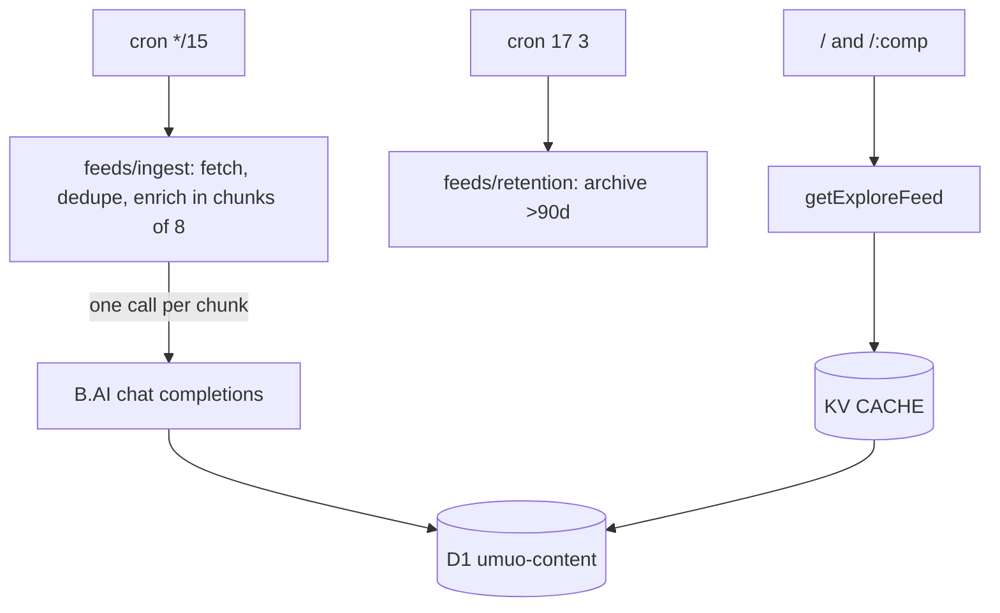

# umuo — AI football news

An AI-curated football news desk. A Cloudflare cron pulls 31 RSS/JSON feed
sources every 15 minutes, a B.AI chat-completions agent (`deepseek-v4-flash`)
classifies and summarises each new article into D1, and an Astro SSR app
renders that corpus as a full-bleed masonry board with a source /
competition / topic index.

Product: `https://umuo.app`

## Architecture



- **Ingest**: fetches every source, drops stored fingerprints + normalized
  titles, then enriches the survivors directly in sequential chunks of eight
  (one LLM call per chunk). A legacy queue consumer remains for old messages.
- **Reads**: `getExploreFeed` / `getArticle` / `getRelatedArticles` behind a
  KV SWR cache (`runCached`); free-text search bypasses KV.
- **Retention**: nightly sweep archives articles older than 90 days — never
  deletes, so fingerprints keep guarding against re-ingest.

## Development

Requires Bun `1.3.14`.

```bash
bun install
bun run dev        # Astro dev with local Miniflare KV + D1
bun run test       # vitest watch (run once: bunx vitest run)
bun run typecheck  # astro check + worker tsc
bun run deploy     # D1 migrations, then wrangler deploy
```

## Repository guide

The authoritative engineering guide — architecture, data flow, conventions,
gotchas, and infrastructure — lives in **[AGENTS.md](./AGENTS.md)**. Key
directories:

- `src/feeds/` — the news pipeline (sources, ingest, LLM, enrichment,
  retention, RSS parsing, readable-body extraction)
- `src/data/api.ts` — KV SWR core + D1 explore queries
- `src/pages/` — `/`, `/[comp]`, `/a/[id]`, RSS + sitemap endpoints
- `worker/` — custom entrypoint (fetch/scheduled/queue) + `/api/*` dispatcher
- `migrations/` — D1 schema (0001–0008), applied by `bun run deploy`

## Product surface

- `/` — global AI football news board with search + competition rail
- `/<comp>` — per-competition hub (e.g. `/eng.1`, `/esp.1`)
- `/a/{id}` — AI summary detail page with related stories
- `/rss.xml`, `/<comp>/rss.xml` — RSS 2.0 feeds
- `/sitemap.xml`, `/sitemap-news.xml` — SEO surfaces
