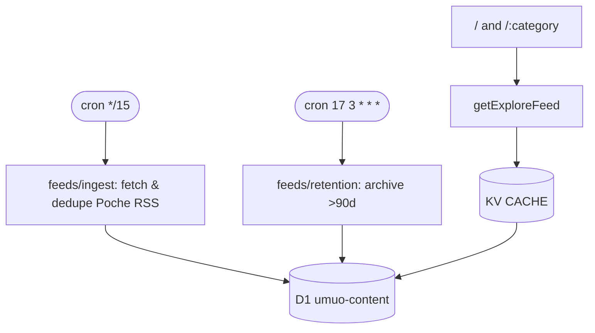

# News Desk Template

> Curated explore feed on Cloudflare Workers. Pull Poche Explore RSS into D1 and render it as a fast Astro masonry board with category hubs, article pages, and RSS feeds.

[](https://deploy.workers.cloudflare.com/?url=https://github.com/youming-ai/umuo)
[](https://bun.sh) [](https://astro.build) [](./LICENSE)

*No ads, no tracking. The bundled config reads Poche Explore RSS; the taxonomy in `src/categories.ts` and source registry in `src/feeds/sources.ts` are yours to replace.*

---

## Features

- **15-min cron ingest** — fetches Poche Explore RSS, de-duplicates by fingerprint + canonical URL + normalized title, and stores new links directly in D1
- **Direct curation** — no model key, scraper, or external enrichment service is required
- **KV SWR cache** — `runCached` with stale-while-revalidate, request coalescing, bounded keys (free-text `q` bypasses KV)
- **Masonry board** — native CSS multi-column, infinite scroll, per-category `/[category]` hubs
- **SEO ready** — `/rss.xml`, `/[category]/rss.xml`, `/sitemap.xml`, canonical/og tags, JSON-LD

## Tech stack

Astro 7 + React islands · Cloudflare Workers (workerd) · D1 + KV · Tailwind · Vitest · Biome · Bun

## Prerequisites

- **Bun ≥ 1.4.0** (`packageManager: bun@1.4.0`)
- Cloudflare account + `bunx wrangler login` for deployment (the local UI and ingest need no third-party API key)

## Quick start

```bash
git clone https://github.com/youming-ai/umuo my-desk && cd my-desk
bun install

# One-time Cloudflare setup:
bunx wrangler kv namespace create CACHE
bunx wrangler d1 create news-desk-content
# → paste the returned ids into wrangler.toml

bun run dev        # http://localhost:4321 (Miniflare KV + D1)
```

| Command | What it does |
|---------|--------------|
| `bun run dev` | Astro dev with local Miniflare |
| `bunx vitest run` | All tests (watch: `bun run test`) |
| `bun run typecheck` | `astro check` + `tsc -p tsconfig.worker.json` |
| `bun run lint` / `format` | Biome |
| `bun run deploy` | **Migrations then deploy** — always use this, not bare `wrangler deploy` |

## Configuration

All knobs are code, not env spaghetti. Edit one file per concern:

| Concern | File | Notes |
|---------|------|-------|
| Branding / origin | `src/site.ts` | `SITE_ORIGIN`, `SITE_NAME`, `SITE_TITLE`, `SITE_DESCRIPTION` |
| Icons / social card | `public/favicon.svg`, `public/og.svg` | Edit the SVG, then rasterize `og.svg` to `og.png` (the default `og:image`) |
| Taxonomy | `src/categories.ts` | `CATEGORIES` — keys become `/:category` routes |
| Ingest source | `src/feeds/sources.ts` | Poche Explore RSS registry; `id` is the stable D1 `source_id` |
| Retention | `src/feeds/retention.ts` | `ARTICLE_ARCHIVE_DAYS` (default 90) |
| Analytics | `src/layouts/Layout.astro` | `TODO(template)` hook — add yours there, nothing ships by default |

No application secret is required. The cron fetches and stores the curated RSS links directly.

## Architecture



- **Ingest** — fetches and parses the Poche RSS feed, then writes new links directly to D1.
- **Reads** — `getExploreFeed` / `getArticle` / `getRelatedArticles` via `runCached`; free-text search bypasses KV (unbounded key space).
- **Retention** — archive, never `DELETE` (keeps `fingerprint`/`canonical_url` guards).

## Product surface

| Route | Description |
|-------|-------------|
| `/` | Global board + search + rail |
| `/:category` | Per-category hub (e.g. `/design`) |
| `/a/:id` | Article summary detail + related stories |
| `/rss.xml`, `/:category/rss.xml` | RSS 2.0 |
| `/sitemap.xml` | Sitemap — hubs, articles, and feeds |
| `/media/:id` | Feed-CDN images, re-served under this origin |

## Deployment

Workers Builds expects **`bun run deploy`** as the build command (not `wrangler deploy` / `versions upload` alone) — otherwise D1 migrations never apply. Preview deploys run `versions upload` and must not touch D1.

Free-tier notes: ingest writes directly to D1; no Durable Objects on purpose — they break `versions upload` previews.

## Cost (approx, Cloudflare free tier)

KV + D1 + Workers free tier covers a personal/small-team desk. The direct RSS ingest has no model or enrichment cost.

## Troubleshooting

- **Empty board locally** — no ingest has run; trigger it by deploying a one-shot cron, wait one cycle, then remove it. Local `wrangler dev` does not run the production cron automatically.
- **Feed fetch failure** — check the Poche endpoint and `RSS_HEADERS` UA; source failures are non-fatal and the registry keeps existing content available.
- **Stale KV** — `runCached` serves `STALE` on upstream failure; check `x-cache` header (`HIT`/`MISS`/`REVALIDATED`/`STALE`).

## Contributing

See [AGENTS.md](./AGENTS.md) for architecture, conventions, and gotchas. PRs welcome.

## License

MIT — see [LICENSE](./LICENSE).