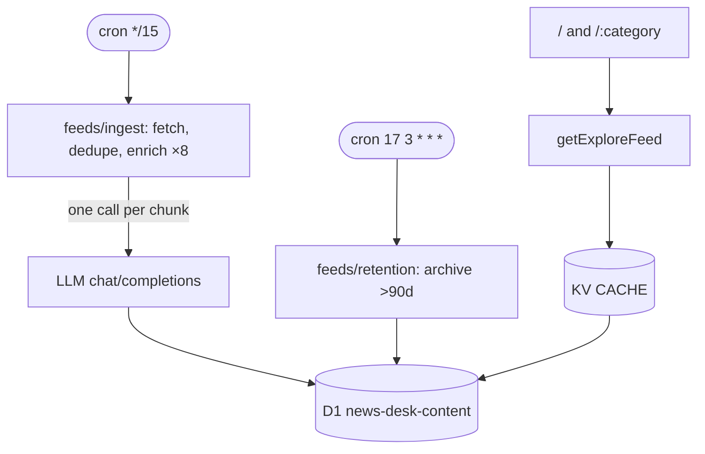

# News Desk Template

> AI-curated news desk on Cloudflare Workers. Pull any RSS/JSON feeds, classify with an OpenAI-compatible LLM, store in D1, render as a fast Astro masonry board. Fork, replace the example config, and you have your own desk.

[](https://deploy.workers.cloudflare.com/?url=https://github.com/youming-ai/umuo)
[](https://bun.sh) [](https://astro.build) [](./LICENSE)

*No ads, no tracking. The bundled config is a technology desk (AI, consumer electronics, PC hardware & peripherals) — the taxonomy in `src/categories.ts` and the sources in `src/feeds/sources.ts` are yours to replace.*

---

## Features

- **15-min cron ingest** — fans out over 20 RSS/Atom sources, de-duplicates by fingerprint + normalized title, enriches in LLM chunks of 8
- **LLM agnostic** — any OpenAI-compatible `chat/completions` endpoint (`deepseek-v4-flash` by default, `LLM_BASE_URL`/`LLM_MODEL` configurable)
- **KV SWR cache** — `runCached` with stale-while-revalidate, request coalescing, bounded keys (free-text `q` bypasses KV)
- **Masonry board** — native CSS multi-column, infinite scroll, per-category `/[category]` hubs
- **SEO ready** — `/rss.xml`, `/[category]/rss.xml`, `/sitemap.xml`, `/sitemap-news.xml` (Google News, last 48h), canonical/og tags, JSON-LD

## Tech stack

Astro 7 + React islands · Cloudflare Workers (workerd) · D1 + KV · Tailwind · Vitest · Biome · Bun

## Prerequisites

- **Bun ≥ 1.4.0** (`packageManager: bun@1.4.0`)
- Cloudflare account + `bunx wrangler login`
- An OpenAI-compatible API key (only for enrichment; the UI works without it)

## Quick start

```bash
git clone https://github.com/youming-ai/umuo my-desk && cd my-desk
bun install
cp .dev.vars.example .dev.vars   # put LLM_API_KEY inside

# One-time Cloudflare setup:
bunx wrangler kv namespace create CACHE
bunx wrangler d1 create news-desk-content
# → paste the returned ids into wrangler.toml

bun run dev        # http://localhost:4321 (Miniflare KV + D1)
```

| Command | What it does |
|---------|--------------|
| `bun run dev` | Astro dev with local Miniflare |
| `bunx vitest run` | All tests (watch: `bun run test`) |
| `bun run typecheck` | `astro check` + `tsc -p tsconfig.worker.json` |
| `bun run lint` / `format` | Biome |
| `bun run deploy` | **Migrations then deploy** — always use this, not bare `wrangler deploy` |

## Configuration

All knobs are code, not env spaghetti. Edit one file per concern:

| Concern | File | Notes |
|---------|------|-------|
| Branding / origin | `src/site.ts` | `SITE_ORIGIN`, `SITE_NAME`, `SITE_TITLE`, `SITE_DESCRIPTION` |
| Taxonomy | `src/categories.ts` | `CATEGORIES` — keys become `/:category` routes |
| Sources | `src/feeds/sources.ts` | `FEED_SOURCES` — `id` is stable D1 `source_id` |
| Classifier | `src/feeds/llm.ts` | `CLASSIFIER_RULES`, `CONTROLLED_TAGS`, `JSON_FIELDS` |
| LLM | `wrangler.toml [vars]` + `wrangler secret put LLM_API_KEY` | Any OpenAI-compatible endpoint |
| Retention | `src/feeds/retention.ts` | `ARTICLE_ARCHIVE_DAYS` (default 90) |
| Analytics | `src/layouts/Layout.astro` | `TODO(template)` hook — add yours there, nothing ships by default |

`.dev.vars.example` is the only required secret. Without `LLM_API_KEY`, ingest still fetches and stores raw feeds; enrichment is skipped.

## Architecture



- **Ingest** — sequential chunks of 8; each chunk writes to D1 before next starts, so a long backlog survives a timeout.
- **Reads** — `getExploreFeed` / `getArticle` / `getRelatedArticles` via `runCached`; free-text search bypasses KV (unbounded key space).
- **Retention** — archive, never `DELETE` (keeps `fingerprint`/`canonical_url` guards).

## Product surface

| Route | Description |
|-------|-------------|
| `/` | Global board + search + rail |
| `/:category` | Per-category hub (e.g. `/keyboards`) |
| `/a/:id` | AI summary detail + related stories |
| `/rss.xml`, `/:category/rss.xml` | RSS 2.0 |
| `/sitemap.xml`, `/sitemap-news.xml` | Sitemaps (latter: Google News, 48h) |

## Deployment

Workers Builds expects **`bun run deploy`** as the build command (not `wrangler deploy` / `versions upload` alone) — otherwise D1 migrations never apply. Preview deploys run `versions upload` and must not touch D1.

Free-tier notes: queue was removed (ingest enriches directly); no Durable Objects on purpose — they break `versions upload` previews.

## Cost (approx, Cloudflare free tier)

KV + D1 + Workers free tier covers a personal/small-team desk. LLM is the only variable cost — 15 feeds × a few hundred articles/day × ~1 LLM call per 8 articles ≈ 30–60 calls/day.

## Troubleshooting

- **Empty board locally** — no ingest has run; trigger it: set a one-shot cron in `wrangler.toml`, deploy, wait one cycle, remove it (`wrangler dev --remote` does not support queues/cron).
- **403 on a source** — some publishers WAF non-browser agents; check the `RSS_HEADERS` UA, and drop sources that demand a browser (the registry keeps failures non-fatal).
- **Stale KV** — `runCached` serves `STALE` on upstream failure; check `x-cache` header (`HIT`/`MISS`/`REVALIDATED`/`STALE`).

## Contributing

See [AGENTS.md](./AGENTS.md) for architecture, conventions, and gotchas. PRs welcome.

## License

MIT — see [LICENSE](./LICENSE).