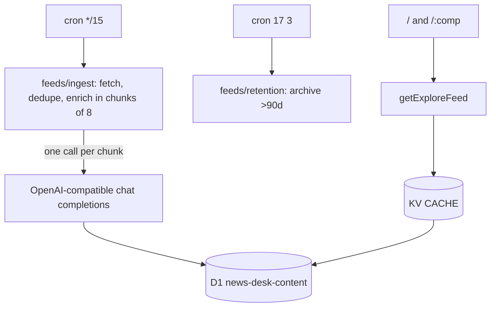

# News Desk Template — AI-curated news on Cloudflare

A minimal, open-source template for an AI-curated news desk. A Cloudflare cron pulls RSS/JSON feeds every 15 minutes, an OpenAI-compatible chat-completions agent classifies and summarises each article into D1, and an Astro SSR app renders it as a masonry board with topic/competition filters. No ads, no tracking — fork and make it yours.

> This is a generic template. The football example in `src/competitions.ts` / `src/feeds/sources.ts` is just that — an example. Replace it with any taxonomy and feeds.

[](https://deploy.workers.cloudflare.com/?url=https://github.com/youming-ai/umuo)

## Quick start

Requires **Bun ≥ 1.4.0**.

```bash
git clone https://github.com/youming-ai/umuo my-desk && cd my-desk
bun install
cp .dev.vars.example .dev.vars   # add LLM_API_KEY
# create Cloudflare resources once:
bunx wrangler kv namespace create CACHE
bunx wrangler d1 create news-desk-content
# paste the returned ids into wrangler.toml, then:
bun run dev         # http://localhost:4321 with local Miniflare KV + D1
bun run test        # vitest (bunx vitest run for single run)
bun run typecheck   # astro check + worker tsc
bun run deploy      # D1 migrations then wrangler deploy (use on every deploy)
```

### Configuration

1. **Branding** — `src/site.ts` (`SITE_ORIGIN`, `SITE_NAME`, `SITE_TITLE`, `SITE_DESCRIPTION`)
2. **Taxonomy** — `src/competitions.ts` (`FOOTBALL_COMPETITIONS`) — keys become `/:comp` routes
3. **Feeds** — `src/feeds/sources.ts` (`FEED_SOURCES`) — `id` is stable D1 `source_id`
4. **Classifier** — `src/feeds/llm.ts` (`CLASSIFIER_RULES`, `CONTROLLED_TAGS`) — prompt for your domain
5. **LLM** — `wrangler.toml [vars] LLM_BASE_URL / LLM_MODEL` + secret `wrangler secret put LLM_API_KEY` (any OpenAI-compatible endpoint)
6. **Analytics** — `src/layouts/Layout.astro` has a `TODO(template)` hook; add yours there

`.dev.vars.example` documents the only required secret: `LLM_API_KEY`. Everything else has sensible defaults and runs without it (ingest skips enrichment).

## Architecture



- **Ingest**: fetches every source, drops stored fingerprints + normalized titles, enriches survivors in chunks of 8 (one LLM call per chunk).
- **Reads**: `getExploreFeed` / `getArticle` / `getRelatedArticles` behind KV SWR (`runCached`); free-text search bypasses KV.
- **Retention**: nightly sweep archives articles older than 90 days — never deletes, so fingerprints guard against re-ingest.

## Repository guide

- `src/feeds/` — news pipeline (sources, ingest, LLM, enrichment, retention, RSS parsing, readable extraction)
- `src/data/` — KV SWR core (`cache.ts`) + D1 queries (`api.ts`, `exploreRss.ts`)
- `src/pages/` — `/`, `/[comp]`, `/a/[id]`, RSS + sitemap endpoints
- `worker/` — Cloudflare entrypoint (`fetch` / `scheduled`) + `/api/*` dispatcher
- `migrations/` — D1 schema, applied by `bun run deploy`

See **[AGENTS.md](./AGENTS.md)** for conventions, testing, and gotchas.

## Product surface

- `/` — global board with search + rail
- `/<comp>` — per-competition/topic hub (e.g. `/eng.1`)
- `/a/{id}` — AI summary detail with related stories
- `/rss.xml`, `/<comp>/rss.xml` — RSS 2.0
- `/sitemap.xml`, `/sitemap-news.xml` — SEO

## License

MIT — see [LICENSE](./LICENSE).
