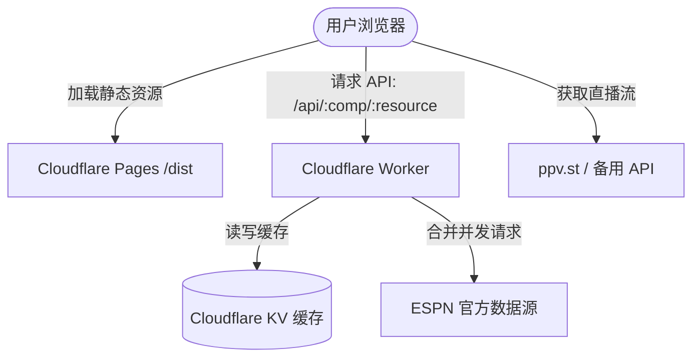

# StreamCup — 体育赛事数据与直播导航系统

StreamCup 是一个高性能、轻量级的体育赛事数据追踪与在线直播导航 Web 系统，支持世界杯（FIFA World Cup）、英超（Premier League）以及 NBA 等多项赛事。系统通过前后端分离的架构，提供极致平滑的交互体验和可靠的数据源代理缓存。

---

## 1. 系统架构与数据流

本系统由前端 React 单页应用（SPA）与后端 Cloudflare Workers 边缘代理两部分构成。



### 1.1 前端单页应用 (SPA)
* **技术栈**：React 18、Vite、Tailwind CSS。
* **自定义路由**：不依赖第三方路由库，使用手写的 History API 路由（`src/utils/router.ts`），并结合 `'app:routechange'` 自定义事件通知页面状态变更，确保极低的包体积与加载性能。
* **数据轮询与 SWR**：前端数据 Hook（如 `useCompetition`、`useMatchDetail`）支持可见性感知（Page Visibility API），在浏览器标签页处于后台时自动暂停轮询，返回前台时立即触发静默刷新，并包含 `AbortSignal` 处理避免竞态冲突。

### 1.2 后端边缘代理 (Cloudflare Worker)
* **资源转发与跨域**：Worker 部署在边缘节点，代理 `/api/:comp/*` 请求至 ESPN API，消除前端跨域（CORS）问题。
* **SWR 缓存机制**：在 Cloudflare KV 中存储原始 JSON 数据，根据资源类型配置不同的 TTL（Scoreboard 为 60 秒，Standings 为 300 秒，Summary 为 30 秒，Leaders 为 1 小时），提供快速的边缘 HIT 响应。
* **并发请求合并 (Request Coalescing)**：使用内存 `Map` 对同一时间内发往相同 ESPN 端点的请求进行合并，确保多个用户同时访问时，仅向 ESPN 服务端发起一次 Fetch 请求，有效减轻上游接口负载并提升系统高并发表现。
* **容灾降级**：当上游 ESPN 服务端发生 5xx 错误时，Worker 自动在后台重试；若接口彻底不可用，则直接向客户端下发 KV 中已过期的 STALE 缓存，确保服务的连续性。

---

## 2. 核心功能模块

### 2.1 赛事切换与多运动数据适配层 (SportAdapter System)
* **动态赛事切换**：支持世界杯（`fifa.world`）、英超（`eng.1`）和 NBA（`nba`）等多赛事切换。系统读取 `src/competitions.ts` 作为单事实源。
* **数据归一化**：定义了统一的 `SportAdapter` 接口（`src/adapters/types.ts`），分别由 `soccer.ts`（足球）和 `basketball.ts`（篮球）适配器实现。将 raw ESPN JSON 归一化为统一的前端数据模型（包含比分、加时赛点球判定、球员数据、球队积分排行等）。
* **动态赛季推导**：通过 `seasonForDate` 实现无硬编码的赛季推导（足球赛季通常以 8 月启动年标识，篮球赛季以 10 月结束年标识），防止写死年份导致数据过期。

### 2.2 赛程对阵看板 (Fixtures & Schedule Dashboard)
* **智能赛程分组**：按开球日期聚合比赛，未完赛/进行中的赛事按时间正序排列，已完赛的赛事按时间倒序排列（最近结束的优先显示）。
* ** coarse-grained / fine-grained 过滤**：
  * 支持“未完赛”与“已结束”分类，并在过滤标签上实时显示对应分组的比赛计数。
  * 杯赛制（World Cup）支持小组赛（Group Stage）、1/16、1/8、1/4、半决赛、三四名决赛、决赛等多阶段过滤。
* **日历提醒订阅**：针对未开赛的比赛，提供原生 `.ics` 格式系统日历导出（处理字符转义防止格式损坏）和 Google Calendar 提醒生成链接。

### 2.3 积分榜与淘汰赛对阵图 (Standings & Bracket)
* **足球积分榜**：展示各小组或联赛球队的“已赛、胜、平、负、净胜球、积分、近况（最近5场）”数据，并根据出线规则高亮标识（如：前两名直接出线、成绩最好的小组第三出线）。
* **篮球分区榜**：针对 NBA 适配 ConferenceStandings 视图，展示东/西部联盟的“胜、负、胜率、胜差”排行。
* **对称淘汰赛对阵图**：对杯赛淘汰赛阶段提供基于 SVG 连接线的树状对阵图视图（从 1/16、1/8 决赛一直延伸至决赛），左右半区对称汇聚至中部的总决赛，支持点击直接跳转至具体比赛详情。

### 2.4 比赛详情与精细数据页签 (Match Detail Pages)
* **实时状态追踪**：支持未开赛、直播中（显示比赛分、时钟、中场）、已结束（完赛、加时、点球大战）的状态徽章标识。
* **多维度数据页签（Tabs）**：
  * **足球页签**：
    * **数据**（Stats）：控球率、射门、犯规、黄红牌等统计。
    * **进程**（Play-by-Play）：区分“全部”与“关键”事件，记录进球、红黄牌、换人等。
    * **阵容**（Lineup）：区分首发和替补，支持点击查看特定球员的本场数据。
  * **篮球页签**：
    * **数据统计**（Boxscore）：展示各节比分及两队球员技术统计（时间、投篮、篮板、助攻、得分等）。
    * **数据**（Stats）：快攻得分、内线得分、失误得分等对比。

### 2.5 球队与球员档案页
* **球队详情页**：展示球队徽章、当前积分榜组别，分类聚合该球队的“未完赛”和“已完赛（倒序）”历史记录，以及队内最佳射手榜。
* **球员详情页**：展示运动员基本信息、国籍/球队背景，并自动遍历全部比赛提取该球员的历次进球记录与时间戳。

### 2.6 安全多线路直播流播放器 (Live Streaming Player)
* **直播源跨源匹配**：通过 Team-name slug 对比，自动将 ESPN 的赛程与外部直播源 API 模糊匹配，若匹配成功则在前端呈现“直播中/观看”入口。
* **安全域白名单校验**：在渲染 iframe 前，利用 `isTrustedStreamUrl` 进行严格的域名白名单匹配，屏蔽非受信源域名，防御 XSS 及恶意重定向。
* **多线路切换与状态感知**：内置线路切换菜单，支持流媒体多信号接入。加载过程中自动渲染带有动画的遮罩，并在信号丢失时提供 Standby（待机）与恢复机制。

### 2.7 个性化设置与国际化 (User Preferences & i18n)
* **多语言本地化**：支持中、英、日、韩四国语言的全面翻译切换。
* **系统级主题切换**：支持 Light/Dark 主题，通过 Tailwind 映射底层设计标记。界面采用玻璃拟态卡片设计（Rounded Glassmorphism Design，比例圆角，类似 Apple Sports 风格）。
* **多端同步**：通过监听 `localStorage` 变化事件，实现不同浏览器标签页间的主题与语言同步。

---

## 3. 本地开发与构建指令

### 3.1 基础配置
* **运行时**：Bun
* **依赖安装**：
  ```bash
  bun install
  ```

### 3.2 常用指令
* **本地开发服务**：
  ```bash
  bun run dev
  ```
  在本地启动 Vite 调试服务，默认端口为 `5173`。

* **生产环境打包**：
  ```bash
  bun run build
  ```
  执行前端静态资源（Vite）打包与 Worker 编译。

* **运行单元测试**：
  ```bash
  bun run test
  ```
  基于 Vitest 运行测试套件。前端组件在 JSDOM 环境中测试，Worker 测试在 Node 环境中测试。

* **静态检查与格式化**：
  ```bash
  bun run typecheck   # 运行 TypeScript 类型检查
  bun run lint        # 运行 Biome 代码检查
  bun run format      # 运行 Biome 自动格式化
  ```

---

## 4. 目录结构

```
├── .superpowers/         # 历史设计演进记录
├── docs/                 # 系统设计规范与实施计划
├── design-tokens/        # 系统设计变量 (colors, radius等)
├── public/               # PWA 清单、Service Worker 及公共静态资源
├── src/
│   ├── adapters/         # 体育数据适配归一化层 (types, soccer, basketball)
│   ├── components/       # UI 组件 (Fixtures, Standings, Bracket, Player 等)
│   │   └── matchdetail/  # 比赛详情页内部 Tabs 组件
│   ├── data/             # 预设静态数据 (世界杯 seeding 等)
│   ├── hooks/            # 自定义 React Hooks (获取赛事、直播流、详情等)
│   ├── i18n/             # 国际化字典定义
│   ├── theme/            # 主题切换逻辑
│   ├── utils/            # 路由、日历、ESPN接口工具类
│   ├── App.tsx           # 应用根路由分发组件
│   └── main.tsx          # 前端渲染主入口
├── worker/               # Cloudflare Worker 代理及测试代码
├── package.json          # 项目配置文件
└── wrangler.jsonc        # Cloudflare Workers 部署配置文件
```
