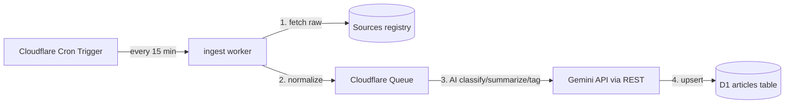

# RFC: AI-Driven Multi-Source Sports News Aggregation

## 1. Context & Goals

`umuo` currently aggregates sports news from a single upstream: ESPN's per-league `site.api` news feeds. The news surface is a conventional lead-story + vertical feed on the home page and a per-competition news hub. We want to evolve this into a multi-source, AI-curated sports-news explorer similar to https://poche.app/explore.

### 1.1 Goals
1. **Multi-source ingestion** — pull sports news from RSS feeds, partner APIs, and selected public sites, not only ESPN.
2. **AI curation** — use an LLM (Gemini) to classify, tag, summarize, score, and de-duplicate articles.
3. **Explorer UI** — redesign the news surface around category/source filters, a search bar, and a dense card grid (poche.app/explore style).
4. **Cloudflare-native backend** — store articles, sources, and metadata in Cloudflare D1; keep the existing KV cache for hot reads; run ingest workers via Cron + Queues; call Gemini REST for all LLM/embedding work.
5. **Backwards compatibility** — keep ESPN scoreboards, standings, match detail, and per-competition sections intact; the new feed is an additional layer that can optionally replace the news tab over time.

## 2. Existing Architecture Recap

- **Astro 7 SSR + React islands** on Cloudflare Workers (`workerd`).
- **Data layer** (`src/data/api.ts`): KV-backed stale-while-revalidate, in-flight coalescing, serve-stale-on-outage. Used by both SSR pages and the `/api/*` Worker bridge (`worker/index.ts`).
- **News today**: `getCompNews`/`getAggregatedNews` fetch ESPN per-league news; `NewsItem` is rendered by `NewsCard` in `NewsView`/`HomeView`.
- **DB/storage**: only KV `CACHE` binding today (`wrangler.jsonc`).
- **UI shell**: 3-column `Layout.astro`, `Header.astro` top sport bar, `LeftNav.astro` per-comp sections, `HomeView.tsx` vertical feed.

## 3. AI Aggregation Mechanism

### 3.1 Source Registry
A pure TypeScript registry (`src/feeds/sources.ts`) defines every source and how to ingest it. This keeps source knowledge out of the DB migration path and makes the registry unit-testable in both app and worker builds.

```ts
export type SourceKind = 'rss' | 'api-json' | 'site-map' | 'manual';

export interface FeedSource {
  id: string;                 // e.g. 'espn-premier-league', 'bbc-sport-football'
  kind: SourceKind;
  name: string;               // display name
  url: string;                // RSS/API/site-map endpoint
  sport?: Sport;              // 'soccer' | 'basketball' | undefined for cross-sport
  comp?: string;              // umuo comp key, when known
  defaultEnabled: boolean;
  // Selector-specific hints
  rss?: {
    itemSelector?: string;    // CSS selector if non-standard RSS
    imageSelector?: string;
  };
  scrape?: {
    articleSelector: string;
    titleSelector: string;
    linkSelector: string;
    summarySelector?: string;
    imageSelector?: string;
    dateSelector?: string;
  };
  // AI curation prompt overrides
  prompt?: {
    tone?: string;
    language?: string;
    extraTags?: string[];
  };
}

export const FEED_SOURCES: FeedSource[] = [ … ];
```

Example initial sources:
- ESPN per-comp news (existing API)
- BBC Sport football / basketball RSS
- Sky Sports football RSS
- ESPN Cricinfo (future) — demonstrates sport extensibility

### 3.2 Ingest Pipeline



1. **Fetch**: the ingest worker fetches each enabled source. RSS is parsed to a normalized `RawArticle` shape (`title`, `url`, `publishedAt`, `summary`, `imageUrl`, `sourceId`, `rawHtml`?). Failures are logged and retried with exponential backoff via Queues.
2. **Normalize**: all articles get a canonical `url` (strip UTM params) and a content hash for de-duplication.
3. **Deduplicate**: before AI processing, compare content hash + normalized URL against D1. If the article already exists and the hash is unchanged, skip.
4. **AI enrichment** (per article batch) via **Gemini API**:
   - **Classification**: sport, league/team entities, article type (`news`, `rumor`, `interview`, `analysis`, `video`, `injury`, `transfer`).
   - **Tags**: 3–7 keyword tags (e.g. `premier-league`, `transfer`, `liverpool`, `injury`).
   - **Summary**: one-sentence headline summary + 2–3 sentence blurb.
   - **Quality score**: 0–100 based on source authority, freshness, topical relevance to active competitions, and click-bait detection.
   - **Entity linking**: map teams/players to existing `COMPETITIONS`/`teams.ts` IDs where possible.
5. **Store**: upsert into D1 `articles` table with `publishedAt`, `qualityScore`, `status` (`pending` → `published` → `archived`).
6. **Curated digest**: a separate daily cron (`0 7 * * *`) generates a "Mission Briefing" style digest of top stories per sport/competition.

### 3.3 LLM Provider: Gemini

We call the **Gemini Interactions API** directly from the Worker using `fetch` (REST).

- Endpoint: `POST https://generativelanguage.googleapis.com/v1beta/interactions`
- Authentication: `x-goog-api-key: env.GEMINI_API_KEY`
- Model: start with `gemini-3.6-flash` for cost/speed; upgrade to `gemini-3.1-pro-preview` if classification quality is insufficient.
- Structured output: use Interactions `response_format` with `type: 'text'`, `mime_type: 'application/json'`, and a JSON `schema` so classification/tags/summary/quality are machine-parseable.
- Storage: set `store: false` on every request. We do not use `previous_interaction_id`, so there is no need to retain interactions in Gemini's storage.
- Batching within a single interaction: the prompt includes N articles as a JSON array; the response schema is an array of enrichment results. N is chosen to keep total tokens well under the model context window. Do **not** use the Gemini Batch API for this; it is not supported by the Interactions endpoint.

A thin `src/feeds/gemini.ts` module wraps the REST call, retries on 5xx/429, and parses the JSON response.

### 3.4 De-duplication & Clustering

- **Fingerprint**: SHA-256 of normalized title + first 120 chars of body + canonical URL host + path (without query).
- **URL canonicalization**: strip `utm_*`, `ref`, `fbclid`, etc.
- **Semantic near-dup detection**: use Gemini's `text-embedding-004` (or latest stable embedding model) to compute embeddings for article titles+summaries; flag pairs with cosine similarity > 0.92 as near-duplicates. Keep the highest-quality/earliest item as the canonical cluster representative. This is the same Gemini API key; no Cloudflare AI binding is used.
- **Cluster table**: `article_clusters` links duplicate articles to a `clusterId` so the UI can show "also reported by X sources".

### 3.5 Quality & Ranking

Default ranking formula (server-side, overridable by UI sort):

```
score = qualityScore * 0.4
      + freshnessScore * 0.3
      + sourceAuthority * 0.15
      + userSignalScore * 0.15   // (phase 2: clicks, saves, upvotes)
```

`freshnessScore` decays linearly from 100 at `publishedAt` to 0 at 48h.

### 3.6 Feedback Loop

- **Editorial flags**: a lightweight admin API (`POST /api/admin/articles/:id/{publish,archive,promote}`) lets operators override AI decisions.
- **Source health**: D1 table `source_health` tracks last ingest time, success rate, and average latency; unhealthy sources are auto-disabled after N consecutive failures.
- **Prompt tuning**: store a small `prompt_versions` table with the LLM prompt used per batch; compare quality scores across versions to pick the best.

## 4. Cloudflare Backend Architecture

### 4.1 Open issue: how to run `scheduled` and `queue` alongside Astro SSR

`@astrojs/cloudflare@14.1.4` removed the `workerEntryPoint` option. The default entrypoint only exports `fetch`; Cron and Queue handlers cannot be attached through the adapter today.

Two candidate approaches:

1. **Single Worker, custom entrypoint built by Wrangler**: write a `src/worker.ts` that imports the Astro SSR bundle + manifest and also exports `scheduled`/`queue`. Update `wrangler.jsonc` `main` to point to the built output of this entrypoint. Risk: Astro's build output layout (`dist/_worker.js/index.js`, `_manifest.json`) is not a stable public API; needs a verified build + deploy before committing.
2. **Separate ingestion Worker**: keep the Astro site as-is (`main: '@astrojs/cloudflare/entrypoints/server'`), and create a second Wrangler project (e.g. `workers/ingest/` with its own `wrangler.jsonc`) for `scheduled` + `queue`. This decouples ingest from the site and is the safer path if option 1 proves fragile.

**Decision**: defer to Phase 0 spike. After the first D1 schema + Queue are created, attempt a local `astro build` + `wrangler deploy --dry-run` with option 1. If the custom entrypoint fails to resolve the Astro manifest or breaks asset serving, fall back to option 2.

### 4.2 Bindings (wrangler.jsonc)

Current Astro Worker (`main` unchanged until entrypoint decision):

```jsonc
{
  "name": "umuo",
  "compatibility_date": "2026-06-24",
  "compatibility_flags": ["nodejs_compat"],
  "main": "@astrojs/cloudflare/entrypoints/server",
  "observability": { "enabled": true },
  "assets": {
    "directory": "./dist",
    "binding": "ASSETS"
  },
  "kv_namespaces": [
    { "binding": "CACHE", "id": "1ec03cc00a6d43068e3d7c4473973fd3" }
  ],
  "d1_databases": [
    {
      "binding": "DB",
      "database_name": "umuo",
      "database_id": "<your-d1-id>"
    }
  ],
  "queues": {
    "producers": [
      {
        "queue": "umuo-ingest",
        "binding": "INGEST_QUEUE"
      }
    ],
    "consumers": [
      {
        "queue": "umuo-ingest",
        "max_batch_size": 10,
        "max_batch_timeout": 5
      }
    ]
  },
  "triggers": {
    "crons": ["*/15 * * * *", "0 7 * * *"]
  }
}
```

Secrets:
- `GEMINI_API_KEY` is set via `wrangler secret put GEMINI_API_KEY` for production.
- For local dev, create a `.dev.vars` file (gitignored) with `GEMINI_API_KEY=<key>`.
- `GEMINI_API_KEY: string` is declared in `env.d.ts`.

### 4.3 D1 Schema

```sql
-- Sources registry mirror (canonical + runtime state)
CREATE TABLE sources (
  id TEXT PRIMARY KEY,
  kind TEXT NOT NULL,
  name TEXT NOT NULL,
  url TEXT NOT NULL,
  sport TEXT,
  comp TEXT,
  config TEXT,          -- JSON: rss/scrape/prompt overrides
  enabled INTEGER NOT NULL DEFAULT 1,
  authority_score INTEGER NOT NULL DEFAULT 50,
  created_at INTEGER NOT NULL,
  updated_at INTEGER NOT NULL
);

-- Ingested articles
CREATE TABLE articles (
  id TEXT PRIMARY KEY,              -- canonical uuid
  source_id TEXT NOT NULL REFERENCES sources(id),
  canonical_url TEXT NOT NULL UNIQUE,
  fingerprint TEXT NOT NULL UNIQUE,
  title TEXT NOT NULL,
  summary TEXT,
  ai_summary TEXT,
  image_url TEXT,
  published_at INTEGER NOT NULL,
  fetched_at INTEGER NOT NULL,
  sport TEXT,
  comp TEXT,
  article_type TEXT,
  quality_score INTEGER NOT NULL DEFAULT 0,
  freshness_score INTEGER NOT NULL DEFAULT 0,
  status TEXT NOT NULL DEFAULT 'pending', -- pending | published | archived
  raw_metadata TEXT,                -- JSON
  created_at INTEGER NOT NULL,
  updated_at INTEGER NOT NULL
);

-- Full-text search index via D1 FTS5 (when available) or fallback to tags
CREATE TABLE article_tags (
  article_id TEXT NOT NULL REFERENCES articles(id),
  tag TEXT NOT NULL,
  PRIMARY KEY (article_id, tag)
);

CREATE INDEX idx_articles_published ON articles(published_at DESC);
CREATE INDEX idx_articles_status_score ON articles(status, quality_score DESC);
CREATE INDEX idx_articles_comp ON articles(comp, published_at DESC);
CREATE INDEX idx_articles_sport ON articles(sport, published_at DESC);
CREATE INDEX idx_article_tags_tag ON article_tags(tag);

-- De-duplication clusters
CREATE TABLE article_clusters (
  article_id TEXT NOT NULL REFERENCES articles(id),
  cluster_id TEXT NOT NULL,
  is_representative INTEGER NOT NULL DEFAULT 0,
  PRIMARY KEY (article_id, cluster_id)
);

CREATE INDEX idx_clusters_cluster ON article_clusters(cluster_id);

-- Source health & ingestion log
CREATE TABLE source_health (
  source_id TEXT PRIMARY KEY REFERENCES sources(id),
  last_fetch_at INTEGER,
  last_success_at INTEGER,
  consecutive_failures INTEGER NOT NULL DEFAULT 0,
  avg_latency_ms INTEGER,
  articles_fetched_count INTEGER NOT NULL DEFAULT 0,
  articles_inserted_count INTEGER NOT NULL DEFAULT 0
);

-- Optional: user signals (phase 2)
CREATE TABLE article_signals (
  article_id TEXT NOT NULL REFERENCES articles(id),
  views INTEGER NOT NULL DEFAULT 0,
  clicks INTEGER NOT NULL DEFAULT 0,
  saves INTEGER NOT NULL DEFAULT 0,
  last_updated INTEGER NOT NULL,
  PRIMARY KEY (article_id)
);
```

### 4.4 Workers & Endpoints

| Worker / Route | Purpose |
|---|---|
| Cron trigger `*/15 * * * *` | Runs `ingestAllSources` to fetch raw articles and push to Queue. |
| Queue consumer | Receives raw articles, calls Gemini Interactions API for enrichment, upserts D1. |
| `GET /api/explore` | Returns paginated, ranked articles. Query params: `sport`, `comp`, `tag`, `source`, `q`, `cursor`, `limit`. Caches in KV (`fresh:60`, `keep:600`). |
| `GET /api/explore/filters` | Returns available categories (sports, sources, tags with counts) for the filter bar. Caches in KV (`fresh:300`). |
| `GET /api/explore/digest` | Daily "Mission Briefing" JSON: top 5 stories per sport + 1-liner summary. |
| `POST /api/admin/...` | (Optional, auth-gated) approve, archive, promote articles; manage sources. |
| Existing `/api/:comp/:resource` | Unchanged for scores/standings/etc. |

### 4.5 Caching Strategy

- **Hot read**: `/api/explore` and `/api/explore/filters` go through the existing `runCached` in `src/data/api.ts` using KV. Cursor pagination means cache keys include `cursor` + filter params.
- **D1 as source of truth**: ingest writes to D1; reads from D1 only on KV miss.
- **R2 for raw HTML** (optional): if we need to re-process articles with a new prompt, store raw fetch payloads in R2 keyed by `source_id/fetched_at/batch.json`.

## 5. UI Redesign: poche.app/explore Style

### 5.1 Reference Analysis

https://poche.app/explore is a community link explorer with:
- **Sticky top bar**: brand, search, hamburger menu, external links (Digest, Telegram, RSS).
- **Filter rails**: two horizontal pill rows — one for **categories** (All, Tools, Development, Design, Articles, Social, Media, …) and one for **sources/teams** (All, Dine, fonter, huan, …).
- **Dense card grid**: each card has a short AI-generated sentence at the top, source domain, article title (with image preview), AI category tag, topic tags, and a comment/action button.
- **No side rails**: the content fills the width; filters are horizontal and sticky or collapsible.
- **Calm, dark-first palette**: muted backgrounds, rounded cards, subtle borders, generous whitespace.

### 5.2 New umuo Explore Page

Route: `/explore` (global) and optionally `/:comp/explore` (competition-scoped).

Layout:
```
┌────────────────────────────────────────────────────────────┐
│  [umuo]   🔍 Search   ☰ Menu   Digest · Telegram · RSS      │
├────────────────────────────────────────────────────────────┤
│  Sport:  All · Football · Basketball                         │
│  Comp:   All · Premier League · LaLiga · NBA · ...           │
│  Tag:    All · Transfers · Injuries · Match Reports · ...    │
├────────────────────────────────────────────────────────────┤
│  ┌────────────┐ ┌────────────┐ ┌────────────┐ ┌────────────┐ │
│  │ AI summary │ │ AI summary │ │ AI summary │ │ AI summary │ │
│  │ domain     │ │ domain     │ │ domain     │ │ domain     │ │
│  │ Title      │ │ Title      │ │ Title      │ │ Title      │ │
│  │ [tag] [tag]│ │ [tag] [tag]│ │ [tag] [tag]│ │ [tag] [tag]│ │
│  └────────────┘ └────────────┘ └────────────┘ └────────────┘ │
│  ...                                                         │
└────────────────────────────────────────────────────────────┘
```

### 5.3 Components to Add / Modify

- `src/pages/explore.astro` — new SSR page. No left/right rails; owns full-width explore shell.
- `src/components/explore/ExploreView.tsx` — React island: filter state, infinite scroll, search.
- `src/components/explore/ExploreCard.tsx` — poche-style card (AI summary ribbon, domain, title, image, tags).
- `src/components/explore/FilterPills.tsx` — horizontal, sticky pill list with counts.
- `src/components/explore/SearchBar.tsx` — full-text search input.
- `src/components/explore/DigestBanner.tsx` — daily briefing banner at the top.
- `src/components/Header.astro` — add `Explore` global tab next to `Odds`; keep existing sport dropdowns.
- `src/data/api.ts` — add `getExploreFeed`, `getExploreFilters`, `getDigest` backed by D1 + KV cache.
- `src/types/index.ts` — add `ExploreArticle`, `ExploreFilterSet`.

### 5.4 Component Card Spec

```tsx
interface ExploreCardProps {
  article: ExploreArticle;
}
// Card layout:
// 1. AI-generated one-liner summary (small, muted, full-width).
// 2. Domain badge + source name (e.g. "espn.com · ESPN").
// 3. Article image (16:10 cover) with title overlaid or below.
// 4. AI category tag (e.g. "Transfer", "Injury", "Analysis").
// 5. Topic tags (e.g. "premier-league", "liverpool").
// 6. Timestamp + quality badge (optional).
```

### 5.5 Theme / Tokens

Align with existing design tokens (`--c-panel`, `--c-chalk`, `rounded-card`, etc.) but relax the 3-column constraint for `/explore`. Use a darker, more editorial background and larger cards.

## 6. Implementation Phases

### Phase 0 — Infra & Schema
1. Create D1 database and add `DB` and `INGEST_QUEUE` bindings to `wrangler.jsonc`. Do not add a Cloudflare `AI` binding; all LLM/embedding calls use Gemini REST with `env.GEMINI_API_KEY`.
2. Add migration SQL under `migrations/0001_ai_news.sql`.
3. Add `FEED_SOURCES` registry in `src/feeds/sources.ts`.

### Phase 1 — Ingest Worker
1. Implement `src/feeds/ingest.ts` with source fetchers for RSS/API.
2. Implement Queue consumer `src/feeds/enrich.ts` that calls the Gemini Interactions API for classification/summary/tags/score.
3. Wire Cron trigger and Queue consumer (pending entrypoint decision in §4.1).
4. Add source health tracking.

### Phase 2 — Explore API
1. Add D1-backed `getExploreFeed`, `getExploreFilters`, `getDigest` to `src/data/api.ts` with KV caching.
2. Add `/api/explore`, `/api/explore/filters`, `/api/explore/digest` routes in the Astro/Worker API layer.

### Phase 3 — Explore UI
1. Build `src/pages/explore.astro` and `ExploreView.tsx` + sub-components.
2. Add `Explore` link to `Header.astro`.
3. Build filter pills, search, infinite scroll, digest banner.
4. Add dark/editorial theme variant if needed.

### Phase 4 — Polish & Feedback
1. Admin endpoints to approve/archive/promote.
2. Near-duplicate clustering with Gemini embeddings.
3. User signals (views/clicks/saves) and ranking tuning.
4. Replace per-comp `NewsView` with `ExploreView` (comp-scoped) after quality threshold is met.

## 7. Open Questions

1. **Gemini model**: start with `gemini-3.6-flash`? If classification quality is low, bump to `gemini-3.1-pro-preview`.
2. **Admin auth**: simple API token in secrets / Cloudflare Access / Durable Objects session store?
3. **Full-text search in D1**: if D1 FTS5 is unavailable in the target environment, filter by tags + title prefix and offload real search to a small client-side index or Vectorize.
4. **How many sources for launch?** Start with 3–5 high-quality sources to validate the AI pipeline before scaling.
5. **Custom entrypoint build path**: confirm the final built path of a custom entrypoint so `wrangler.jsonc` `main` points correctly after `astro build`.

## 8. First Concrete Steps

1. Update `env.d.ts` to add `GEMINI_API_KEY: string` alongside `CACHE`/`ASSETS`.
2. Create `.dev.vars` (gitignored) locally with `GEMINI_API_KEY=<key>`; plan `wrangler secret put GEMINI_API_KEY` for production.
3. Create `src/worker.ts` custom entrypoint exporting `fetch` (Astro handler), `scheduled`, and `queue` — **or** decide to use a separate ingest Worker after build spike.
4. Update `astro.config.mjs` if needed; primarily ensure the adapter still builds the SSR bundle that the custom entrypoint imports.
5. Update `wrangler.jsonc`: decide on `main`, add `DB` (D1), `INGEST_QUEUE` producer+consumer, and `triggers.crons`. Do **not** add a Cloudflare `AI` binding; all LLM/embedding calls go to Gemini REST with `env.GEMINI_API_KEY`.
6. Run `wrangler d1 create umuo` and note `database_id`; create queue with `wrangler queues create umuo-ingest`.
7. Write `migrations/0001_ai_news.sql` from the schema in §4.
8. Create `src/feeds/sources.ts` with 3 initial sources (ESPN existing per-comp feed, BBC Sport football RSS, Sky Sports football RSS).
9. Create `src/feeds/types.ts` for `RawArticle` and `EnrichedArticle`.
10. Implement `src/feeds/ingest.ts` Cron handler and the Queue producer.
11. Implement `src/feeds/enrich.ts` Queue consumer that calls Gemini Interactions API.
12. Implement `src/feeds/gemini.ts` REST client with retry, `store: false`, and JSON schema parsing.
13. Add `/api/explore` route and D1 read function in `src/data/api.ts`.
14. Stub `src/pages/explore.astro` + `ExploreView.tsx` with filter pills and a static grid.

---

*Co-Authored-By: Claude <noreply@anthropic.com>*
